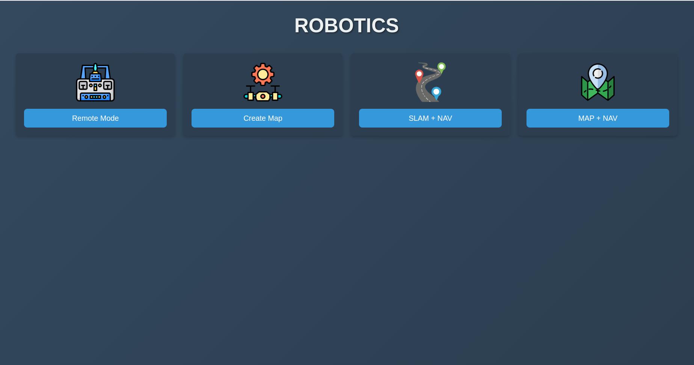
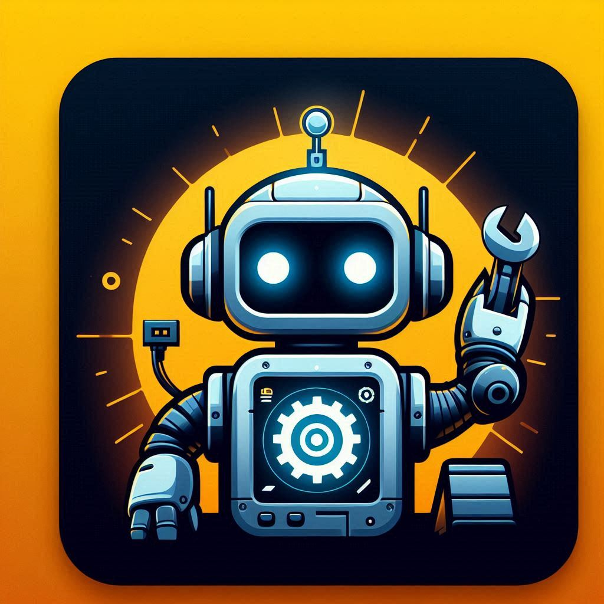

# ROS2-Web-App
[](https://opensource.org/licenses/MIT)
<p align="center">


</p>

This project is a web application that provides a user-friendly interface for controlling and interacting with a robot using ROS 2 commands. Communication between the frontend and the robot is enabled through **WebSockets**, using the **rosbridge_server** to expose ROS 2 functionalities via a JSON API.
### Key technologies include:

- **ReactJS**: For building dynamic and efficient user interfaces.
- **Node.js** and **Express**: Used for the backend server, providing a flexible and minimal framework.
- **rosbridge_server**: Facilitates WebSocket communication between the web app and ROS 2.
- WebSockets: Enables full-duplex communication between frontend and backend in real time.
- **CSS**: Ensures a modern and responsive UI design.
This setup allows for seamless interaction with the robot, whether it’s for remote control, mapping, or navigation.

## Dependencies 
Make sure to install the dependencies
- Node.js
- npm
- React
- Express
- CORS
- ROSLIB
- rosbridge_suite

## Features

- **Remote Mode:** Start the Robot in remote control mode.
- **SLAM + NAV:** Launch the Robot's SLAM (Simultaneous Localization and Mapping) and navigation system.
- **MAP + NAV:** Use a pre-built map for navigation.
- **Create Map:** Launch the process to create a new map using the Robot.

## Prerequisites

Before you begin, ensure you have met the following requirements:

- **ROS 2 Humble:** Installed on your machine. Follow the official ROS 2 installation guide for your operating system.
- **Python 3.8+**
- **Node.js and npm:** Required if you are running the React frontend.

## Setting Up the Backend

1. **Clone the Repository:**

    ```bash
    git clone https://github.com/mayankysharma/ROS2-ReactJS-App.git
    cd ROS2-ReactJS-App/
    ```


2. **Ensure ROS 2 is sourced:**

    Add the following line to your `.bashrc` or execute it in your terminal:

    ```bash
    source /opt/ros/humble/setup.bash
    ```


3. **Run the Backend NodeJS server:**

    ```bash
    cd backend/
    node server.js
    ```

## Setting Up the Frontend

1. **Navigate to the frontend directory (if applicable):**

    ```bash
    cd ros2-react-app/
    ```

2. **Install the required npm packages:**

    ```bash
    npm install
    ```

3. **Start the React development server:**

    ```bash
    npm start
    ```

    The frontend should now be running on `http://localhost:3000`.
## Run Front and Backend together
### Make sure to edit `run_commands.sh` file by giving proper paths 
#### Giving permission to the shell script
```bash
cd robot_ui_app/
chmod +x run_commands.sh
```
#### Then run shell script
```bash
 cd robot_ui_app/
./run_commands.sh
```
## Use a `start.desktop` file to run the shell script
#### Created a .desktop file to run the shell script by clicking on a icon.


<div style>
  
</div>

## License

This project is licensed under the MIT License - see the [LICENSE](LICENSE) file for details.
